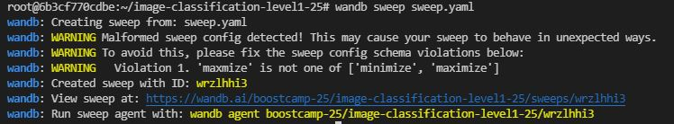

# 슬기로운 캠퍼생활

## :santa: How to use Wandb log

1. Setting
    create your wandb.env file
    - input
        >WANDB_AUTH_KEY=alskjeiowj32klxncvasdijoiwej1
        
        >you can get api key on [wandb_site](https://wandb.ai/settings) 

2. Command
    
    - you have to change parameter --wandb_unique_tag **something** to you want
    ```
    # using single model 
    python train.py --epochs 3 --batch_size 32 --wandb_unique_tag something

    # using fold model
    python train.py --epochs 3 --batch_size 32 --wandb_unique_tag something --fold 3
    ```

## :christmas_tree: How to use wandb sweep
1. Setting
    - change sweep.yaml file
2. Command
    
    - create sweep graph 

        ```
        wandb sweep sweep.yaml
        ```
    - then you can get url

        

    - you have to change **sweepID**

        ```
        wandb agent boostcamp-25/image-classification-level1-25/sweepID
        ```
